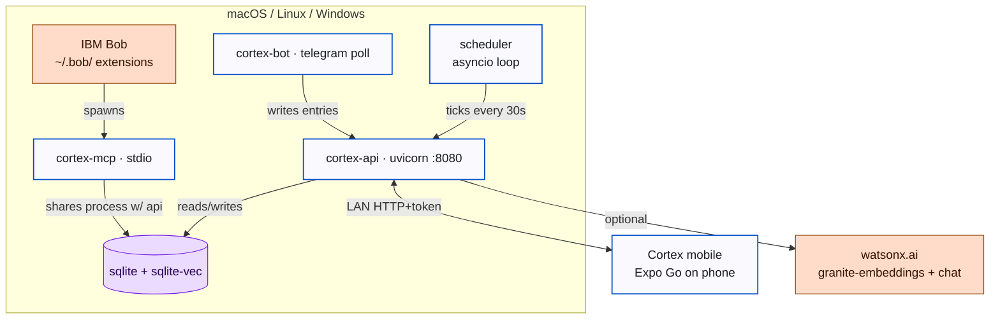
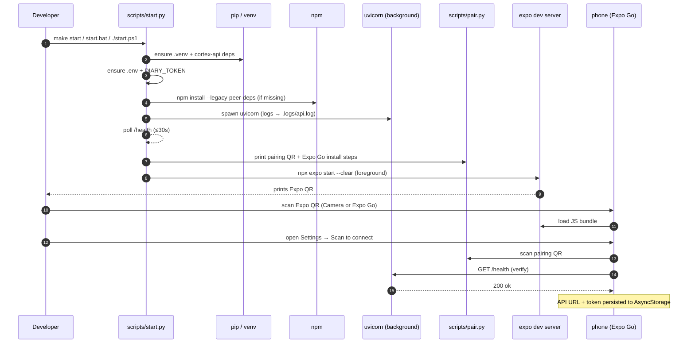
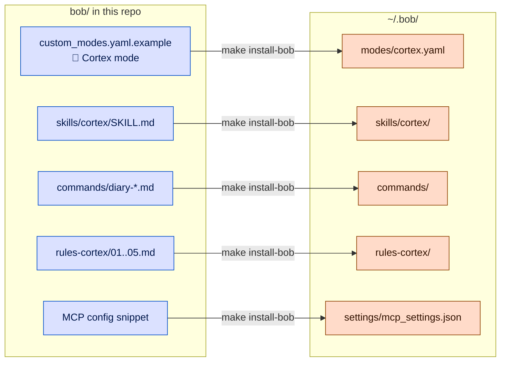
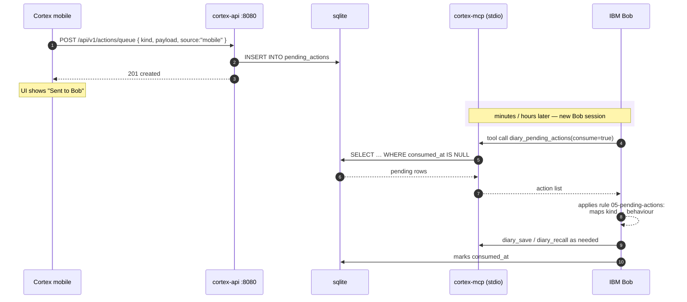
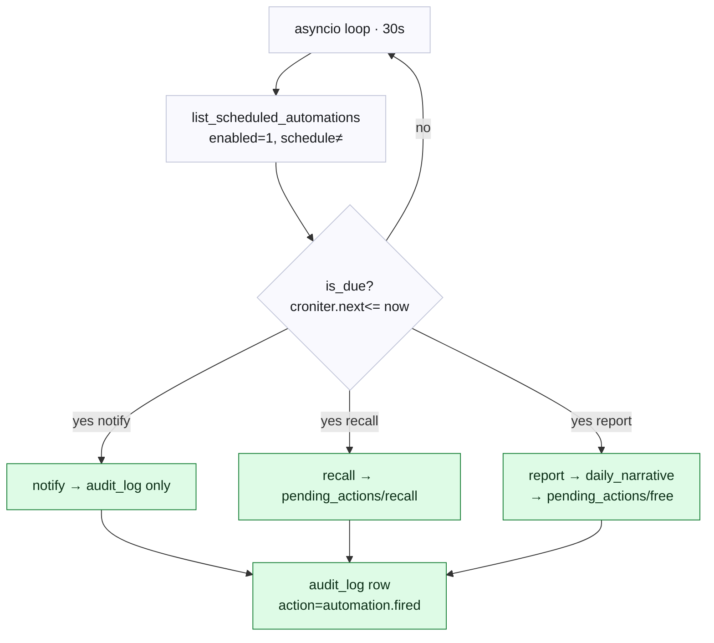
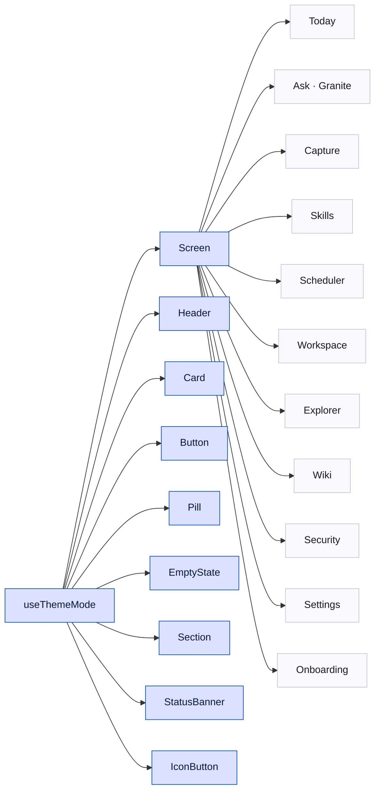

# Cortex — Architecture

Diagrams as Mermaid (renders natively on GitHub). Each one targets a specific question — read the headers and skip the rest.

---

## 1. The mental model — three tiers of memory

Cortex is **memory · reasoning · action.** Local-first by default; escalates to IBM Bob when the work outgrows the phone.

```mermaid
flowchart LR
    classDef tier fill:#dbe1ff,stroke:#004cca,stroke-width:1px,color:#00174b
    classDef act  fill:#ebdcff,stroke:#731be5,stroke-width:1px,color:#270058
    classDef bob  fill:#ffdbc9,stroke:#8e4000,stroke-width:1px,color:#321200

    capture[Capture<br/>phone · terminal · telegram]:::tier
    diary[Diary<br/>sqlite-vec on-device]:::tier
    granite[Granite RAG<br/>local + watsonx]:::act
    queue[pending_actions<br/>queue]:::act
    bob[IBM Bob<br/>full session w/ context]:::bob

    capture --> diary
    diary -- vector + recency rerank --> granite
    granite -- "answer + citations" --> user((you))
    granite -- "needs work" --> queue
    queue -- diary_pending_actions MCP --> bob
    bob -- edits files / replies --> user
```

---

## 2. System topology — what runs where

The full process graph. Every arrow is over loopback or LAN; nothing crosses the internet except the optional watsonx call.

---

## 3. One-command boot (`make start`)

What `scripts/start.py` does, in order. Each step is **idempotent** — skipped if already done.

---

## 4. IBM Bob extension surfaces

Cortex uses **all five** of Bob's documented extension layers. `make install-bob` copies the right files to `~/.bob/`.

---

## 5. The handoff — phone → Bob

What happens when the user taps **"Send to Bob"** in the Workspace screen. The phone never blocks waiting for Bob; Bob picks the action up on its next session.

---

## 6. The cron scheduler

`automations` rows now have a `schedule` (5-field cron) + `last_run_at` + `run_count`. The scheduler ticks every 30 s and dispatches by trigger kind.

---

## 7. The mobile design system

Every screen composes from `cortex-mobile/src/components/ui/`. Theme-aware via `useThemeMode()`; dark mode propagates without per-screen wiring.

---

*Generated diagrams — keep this file in sync when the architecture changes. The Mermaid source can be re-rendered into PNG/SVG with `mmdc` if needed for slide decks.*
